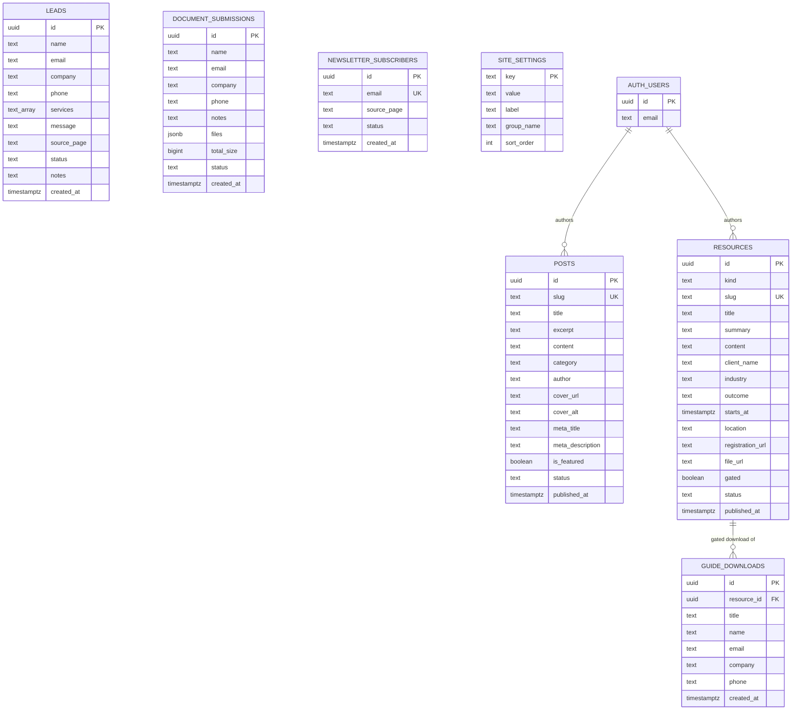
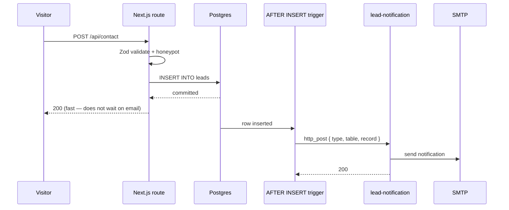

# TaxElixir — Database Design

Postgres via Supabase. Eight tables, three storage buckets, one edge function.

Run the migrations in order:

```
supabase/migrations/0001_init.sql        leads · posts · document_submissions · site_settings + buckets
supabase/migrations/0002_resources.sql   resources · guide_downloads + resource-files bucket
supabase/migrations/0003_newsletter.sql  newsletter_subscribers
supabase/migrations/0004_webhooks.sql    triggers → lead-notification edge function
```

---

## Entity overview



Only one real foreign key exists — `guide_downloads.resource_id → resources.id`,
`on delete set null` so deleting a guide never destroys the record that someone
requested it. Everything else is deliberately independent: these are capture
tables and content tables, not a normalised transactional model, and joining
them would buy nothing.

---

## Tables

### 1. `leads` — contact form submissions

| Column | Type | Notes |
|---|---|---|
| `id` | `uuid` PK | `gen_random_uuid()` |
| `created_at` | `timestamptz` | `now()` |
| `name` | `text` **not null** | |
| `email` | `text` **not null** | |
| `company` | `text` | Firm name |
| `phone` | `text` | |
| `services` | `text[]` | Multi-select chips from the form |
| `message` | `text` | |
| `source_page` | `text` | Which page the form was submitted from |
| `status` | `text` | `new · contacted · qualified · won · lost · archived` |
| `notes` | `text` | Internal, admin-only |

Indexes: `created_at desc`, `status`.
`services` is a `text[]` rather than a join table on purpose — it is a fixed
list of marketing checkboxes, never queried relationally, and a junction table
here would be structure for its own sake.

### 2. `document_submissions` — secure client uploads

| Column | Type | Notes |
|---|---|---|
| `id` | `uuid` PK | |
| `created_at` | `timestamptz` | |
| `name`, `email` | `text` **not null** | |
| `company`, `phone`, `notes` | `text` | |
| `files` | `jsonb` | `[{ name, path, size, type }]` |
| `total_size` | `bigint` | Denormalised sum, so the list view needs no aggregation |
| `status` | `text` | `new · downloaded · archived` |

`files` is a JSON manifest, not a child table. The rows are written once and read
as a unit; a `files` table would add a join to every read for no query benefit.
The `path` values point into the **private** `client-documents` bucket.

### 3. `posts` — the Insights CMS

| Column | Type | Notes |
|---|---|---|
| `id` | `uuid` PK | |
| `slug` | `text` **unique** | URL segment |
| `title`, `excerpt`, `content` | `text` | `content` is sanitised HTML from TipTap |
| `category`, `author` | `text` | |
| `cover_url`, `cover_alt` | `text` | Alt is a separate column so it is a required editorial decision, not an afterthought |
| `meta_title`, `meta_description` | `text` | Fall back to title/excerpt when null |
| `is_featured` | `boolean` | |
| `status` | `text` | `draft · published` |
| `published_at` | `timestamptz` | Stamped on first publish, then stable |
| `updated_at` | `timestamptz` | Maintained by trigger |

Index: `(status, published_at desc)`, plus unique on `slug`.

### 4. `resources` — case studies, events, guides

One table with a `kind` discriminator rather than three near-identical tables.
The shared columns dominate; the kind-specific ones are nullable and only ever
populated for their own kind.

| Column | Type | Applies to |
|---|---|---|
| `kind` | `text` | `case_study · event · guide` |
| `slug` | `text` **unique** | all |
| `title`, `summary`, `content` | `text` | all |
| `cover_url`, `cover_alt` | `text` | all |
| `client_name`, `industry`, `outcome` | `text` | case studies (`client_name` null ⇒ "Anonymised") |
| `starts_at`, `location`, `registration_url` | — | events (`location` null ⇒ online) |
| `file_url`, `gated` | — | guides |
| `meta_title`, `meta_description`, `is_featured` | — | all |
| `status`, `published_at`, `updated_at` | — | all |

Indexes: `(kind, status, published_at desc)`, plus a partial index on
`starts_at` where `kind = 'event'`.

**`starts_at` is what makes the events page self-maintaining.** Upcoming and Past
are derived from the timestamp at read time, so an event cannot sit under an
"Upcoming" heading months after it happened — the failure the competitor site
currently has.

### 5. `guide_downloads` — gated-guide capture

`resource_id → resources.id on delete set null`. Denormalises `title` so the
record still reads correctly after the guide it refers to is deleted.

### 6. `newsletter_subscribers`

`email` is **unique**. The API treats a duplicate insert (`23505`) as success —
telling a visitor "you are already subscribed" leaks list membership to anyone
who can guess an address.

### 7. `site_settings` — single source of truth for figures

| Column | Type |
|---|---|
| `key` | `text` **PK** |
| `value` | `text` nullable |
| `label`, `group_name`, `sort_order` | display metadata |

Seeded with **null** values on purpose. A null renders an em dash on the public
site, never a zero and never a fabricated number.

This table exists to prevent a specific failure: unisonglobus.com hard-codes its
headline figures per page, and they drifted until the UK page claimed 500+
clients while the global page claimed 350+.

#### Where these values appear

Read through [`lib/settings.ts`](../lib/settings.ts), which wraps the query in
React's `cache()` so one render pass issues a single query no matter how many
components ask.

| Key | Group | Renders in |
|---|---|---|
| `years` · `professionals` · `firms` · `returns` | `stats` | `Stats` section — homepage and `/about` |
| `phone` | `contact` | TopBar (every page), Footer, `/contact` |
| `address` | `contact` | Footer, `/contact` |
| `linkedin` | `contact` | Footer |

`lib/content.ts` and `lib/site.ts` hold the **definitions** — which figures exist,
their labels and suffixes, and the brand's fixed details. This table holds the
**values**. Where a value is unset the static default applies; where that is also
null, an em dash.

The marketing tree sets `revalidate = 300`, so an edit in the admin appears
within five minutes without a rebuild.

**Non-numeric values are echoed verbatim, never coerced.** `Number("")` is `0` in
JavaScript, so stripping non-digits from `"TBC"` or `"**"` and passing the result
to a counter would render **"0+"** — the precise failure this table exists to
avoid. `Stats` only animates a value that actually contains digits.

### 8. `auth.users` — Supabase-managed

No public sign-up. Admin accounts are created in the dashboard. The app never
writes to this table; it only checks `auth.getUser()`.

---

## Row-level security

RLS is enabled on **every** table. The model is uniform:

| Table | `anon` | `authenticated` (admin) |
|---|---|---|
| `leads` | INSERT only | full |
| `document_submissions` | INSERT only | full |
| `guide_downloads` | INSERT only | SELECT, DELETE |
| `newsletter_subscribers` | INSERT only | full |
| `posts` | SELECT where `status='published'` **and** `published_at <= now()` | full |
| `resources` | SELECT where `status='published'` **and** `published_at <= now()` | full |
| `site_settings` | SELECT | full |

Two things worth stating explicitly:

**Drafts are hidden by RLS, not by a query filter.** `lib/posts.ts` also filters
on status — belt and braces — but if that filter were ever dropped, the database
would still refuse to return drafts to an anonymous client.

**No public read on capture tables.** `anon` can insert a lead and can never read
one back. An anon-readable `newsletter_subscribers` would be an email harvest.

---

## Storage buckets

| Bucket | Public | Limit | Purpose |
|---|---|---|---|
| `client-documents` | **No** | 50 MB | Client tax records. Admin downloads via 60-second signed URLs through `/api/admin/download`, which checks for a session first. **Never set this public.** |
| `post-media` | Yes | 10 MB | Images placed inline by the rich-text editor and article covers |
| `resource-files` | Yes | 25 MB | Downloadable guides and case-study PDFs |

---

## Notification flow



Four tables fire the same trigger — `leads`, `document_submissions`,
`guide_downloads`, `newsletter_subscribers`. The edge function switches on
`table` to build the right email, so adding a fifth notifying table is one more
trigger and no new Deno code.

**Why the trigger and not the API route.** The row is the source of truth. If SMTP
is down the lead is still captured and the webhook retries; mailing from the
route would either lose the notification or make the visitor wait on it. It also
means a lead arriving by any other path — a seeded import, a future form — is
notified too, because the trigger is on the data rather than on one endpoint.

The trigger swallows its own errors (`exception when others`) so a notification
failure can never roll back the insert.

### Secrets

```bash
supabase functions deploy lead-notification
supabase secrets set \
  SMTP_HOST=smtp.gmail.com \
  SMTP_PORT=465 \
  SMTP_USER=leads@taxelixir.com \
  SMTP_PASS=<app password> \
  NOTIFICATION_EMAIL=info@taxelixir.com
```

> **Security note.** The Anchor implementation this was ported from has its SMTP
> host, username and Gmail app password hardcoded in the committed source file.
> This version reads all of them from `Deno.env`. If those Anchor credentials are
> still live, they should be rotated — a committed mailbox password is a mailbox
> somebody else owns.

---

## Conventions

- **`uuid` primary keys** via `gen_random_uuid()` — capture tables are written by
  anonymous clients, and a sequential integer would leak volume to anyone who
  submits a form twice.
- **`timestamptz` everywhere**, never `timestamp`. The delivery team is in India
  and the clients are in the US; a naive timestamp is a bug waiting for a
  deadline.
- **`status` as a `text` column with a `CHECK`** rather than a Postgres `enum` —
  adding a value to an enum needs a migration and locks; a check constraint is a
  one-line change.
- **Soft states, not deletes.** `archived` on leads and uploads, `draft` on
  content. Nothing a visitor submits is destroyed by an admin's routine action.
- **`updated_at` by trigger** (`public.touch_updated_at()`), so it cannot be
  forgotten at a call site.
